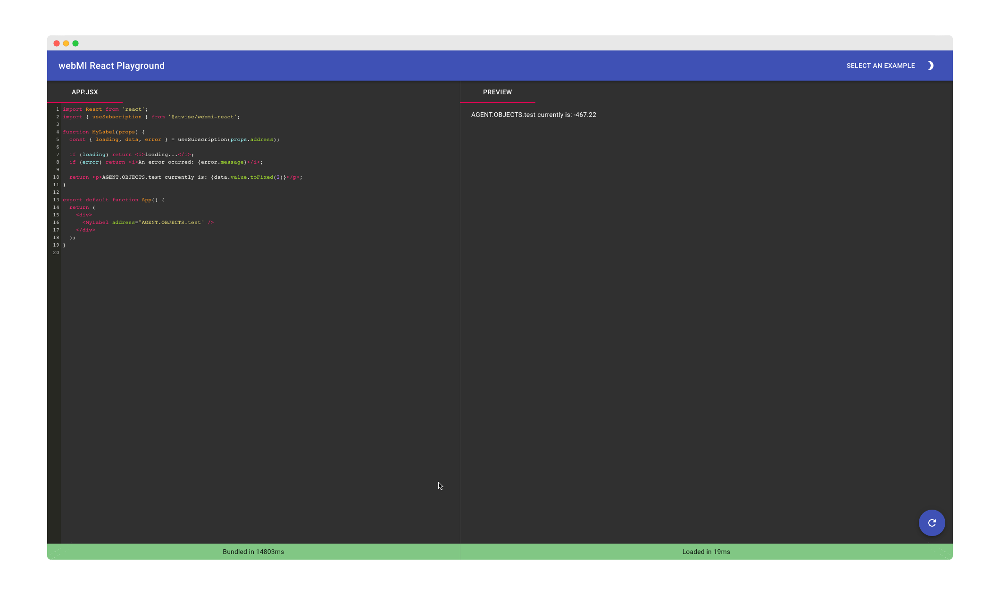

# @atvise/caa-playground

> A playground that allows you to explore the benfits of using React in an atvise project online. Of course, it's an atvise/React app itself 😀

Check back for an online version soon!

<!-- BEGIN footer -->
<!-- This section is generated, do not edit it! -->

---

This package is part of the [create-atvise-app](https://github.com/LukasHechenberger/create-atvise-app#readme) project.

Refer to [it's documentation](https://github.com/LukasHechenberger/create-atvise-app#readme) for more information.

<!-- END footer -->
